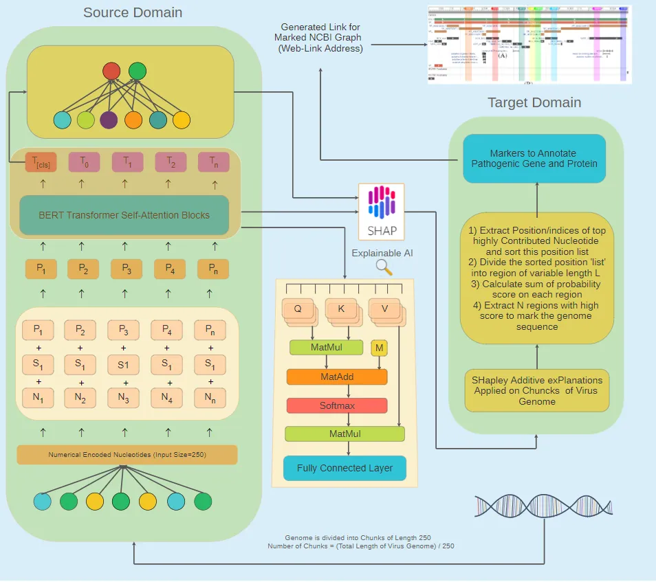

# 🧬 VirTransformer-250bp

**VirTransformer-250bp** is a Transformer-based AI model designed to predict whether a viral genome can infect *Homo sapiens* cells directly from **nucleotide sequences** — without using host or protein biomarkers.




**VirTransformer-250bp** is a Transformer-based AI model designed to predict...

This repository includes:
- 🧠 **Hugging Face implementation** — main app, model, and interface
- ⚙️ **Python client** — for local or Render deployment
- 🖼️ **Model architecture** — visualized in `model.png`

---

## 🚀 Overview

VirTransformer-250bp analyzes raw DNA sequences (usually 250 base pairs) and predicts:
- ✅ Potential to infect human cells
- This model can be Finetune for numerous downstream Tasks
   🧫 ICTV taxonomic classification  
   🧬 Baltimore classification  
   ☣️ Oncogenic potential  

The model was trained on thousands of diverse viral genomes and evaluated on unseen species, achieving over **92.5% accuracy**.

---

## 📂 Repository Structure

```
VirTransformer-250bp/
│
├── HuggingFace/           # Hugging Face Space app and model
│   ├── app.py             # Gradio interface for user input & prediction
│   ├── requirements.txt   # Space dependencies
│   └── model/             # Trained transformer weights (if included)
│
├── Client/                # Python client for local/Render deployment
│   ├── client.py          # Script for local predictions
│   ├── api.py             # API backend (optional)
│   └── requirements.txt   # Client dependencies
│
├── model.png              # Model architecture / workflow diagram
└── README.md              # Documentation
```

---

## 🧩 Features

- Accepts raw viral nucleotide or FASTA sequences  
- Predicts multiple viral properties using a single transformer model  
- Interactive Gradio app on Hugging Face  
- Easily deployable via **Render** or **local environment**  
- Built with **PyTorch**, **Transformers**, and **Gradio**

---

## ⚙️ How It Works

1. **Input:** A viral nucleotide sequence (≈250bp)  
2. **Tokenization:** Converts sequence into overlapping k-mers  
3. **Embedding:** Passes through transformer encoder layers  
4. **Prediction:** Outputs probabilities for infection and classification  
5. **Visualization:** Gradio app displays results interactively  

---

## 🧠 Model Deployment

### ▶️ On Hugging Face

Try it online:  
🔗 [https://rajaatif786-virtransformer-250bp.hf.space](https://rajaatif786-virtransformer-250bp.hf.space)

Paste a nucleotide sequence and get:
- Predicted human infectivity  
- Virus class and other properties  

### 🐍 Local Prediction (Python Client)

```bash
cd Client
pip install -r requirements.txt
python client.py
```

Then enter your viral sequence when prompted.

---

## 📊 Model Details

- **Architecture:** Transformer Encoder  
- **Input length:** 250bp nucleotide fragments  
- **Training:** Viral genome datasets (species-level and virus-level split)  
- **Accuracy:** >92.5%  
- **Hardware:** NVIDIA A100 GPU  
- **Frameworks:** PyTorch + Gradio  

---

## 📜 Citation

If you use this project in your research, please cite:

> **Raja Atif Aurang Zaib.** (2024).  
> *Prediction of Human Pathogenicity from Viral Genome Sequences Using Transformer-Based Deep Learning.*  
> SSRN Electronic Journal.  
> [https://papers.ssrn.com/sol3/papers.cfm?abstract_id=4978320](https://papers.ssrn.com/sol3/papers.cfm?abstract_id=4978320)

---

## 💡 Acknowledgment

Inspired by the work of **Jakub Bartoszewicz** on interpretable viral detection.  
Developed and extended independently by **Raja Atif Aurang Zaib**.

---

## 🧰 License

Released under the **MIT License**.  
You’re free to use, modify, and distribute with proper attribution.

---

## 📬 Contact

**Author:** Raja Atif Aurang Zaib  
🌐 Hugging Face: [@rajaatif786](https://huggingface.co/rajaatif786)  
🔗 Demo: [VirTransformer-250bp App](https://bioaml.com/pathogenicity.html)
